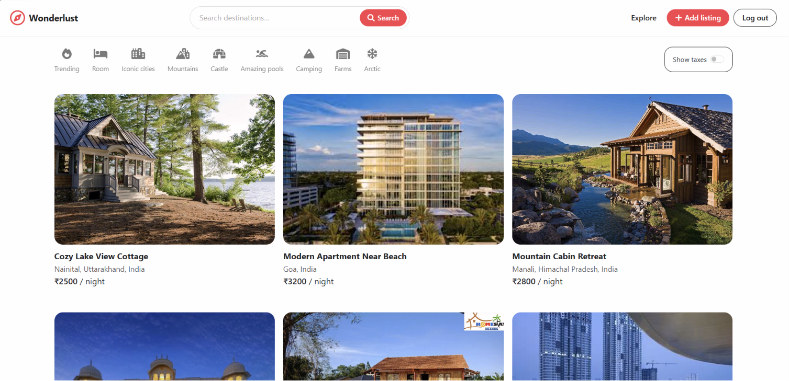
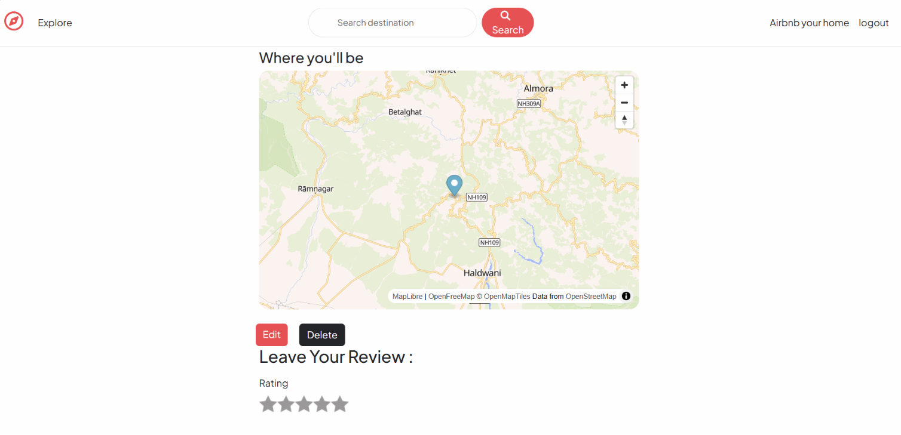
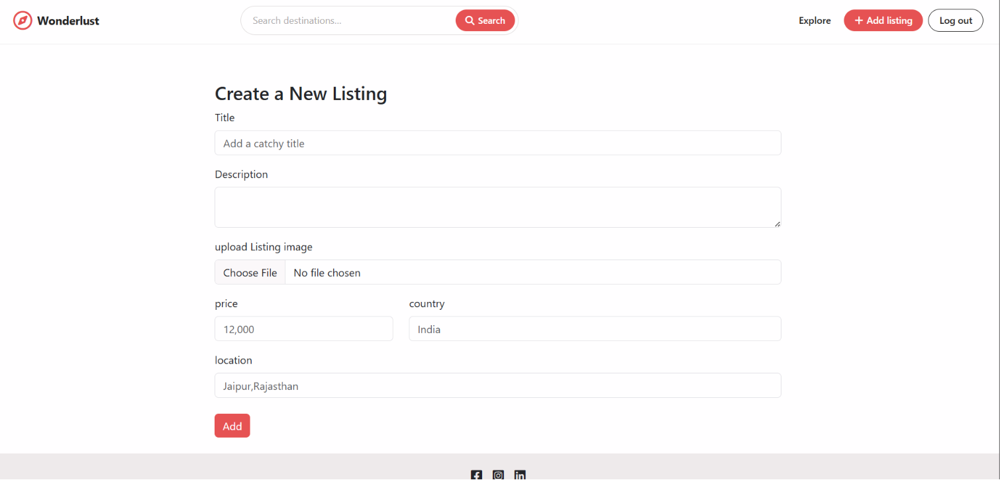
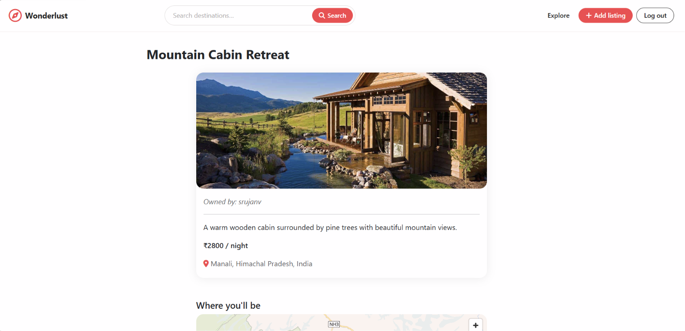

# Wonderlust

Wonderlust is a full-stack travel listing platform inspired by modern stay-booking experiences. It lets users create listings, upload images, explore destinations, filter listings by travel category, search by location, leave reviews, and view mapped listing locations.

## Live Deployment
https://wonder-lust-sm1n.onrender.com/listings

[Deploy on Render](https://render.com/deploy?repo=https://github.com/Srujan-017/Wonder-Lust)

After creating the Render service, add the required environment variables from your local `.env` file in the Render dashboard. Do not commit real secrets to GitHub.

## Screenshots

### Explore Listings



### Listing Details With Map



### Create Listing



### Editing listings




## Features

- User authentication with Passport.js
- Create, edit, and delete property listings
- Cloudinary image uploads
- Listing reviews with ratings
- Category filters for travel styles like mountains, rooms, camping, farms, and pools
- Destination search by title, location, or country
- Geoapify-powered geocoding for listing coordinates
- Free OpenFreeMap and MapLibre map rendering
- MongoDB Atlas database integration
- Session storage with `connect-mongo`
- Server-side validation with Joi

## Tech Stack

- **Backend:** Node.js, Express.js
- **Database:** MongoDB Atlas, Mongoose
- **Templating:** EJS, EJS Mate
- **Authentication:** Passport.js, Passport Local Mongoose
- **Image Hosting:** Cloudinary
- **Maps & Geocoding:** Geoapify, MapLibre, OpenFreeMap
- **Styling:** Bootstrap, custom CSS
- **Deployment:** Render

## Environment Variables

Create a `.env` file in the project root using `.env.example` as a reference.

```env
ATLASDB_URL=your_mongodb_atlas_connection_string
SECRET=your_session_secret

CLOUD_NAME=your_cloudinary_cloud_name
CLOUD_API_KEY=your_cloudinary_api_key
CLOUD_API_SECRET=your_cloudinary_api_secret
GEOAPIFY_API_KEY=your_geoapify_api_key
```

## Local Setup

Install dependencies:

```bash
npm install
```

Start the app:

```bash
npm start
```

Open the app:

```text
http://localhost:8080/listings
```

## Render Deployment Notes

The project includes a `render.yaml` blueprint. Render will ask for these secret values during deployment because they are marked with `sync: false`:

- `ATLASDB_URL`
- `SECRET`
- `CLOUD_NAME`
- `CLOUD_API_KEY`
- `CLOUD_API_SECRET`
- `GEOAPIFY_API_KEY`

Use the same values from your local `.env`, but enter them only in the Render dashboard.

## Security

The repository intentionally ignores:

- `.env`
- `node_modules/`
- log files
- temporary server output files

This keeps API keys, database credentials, and local generated files out of GitHub.
